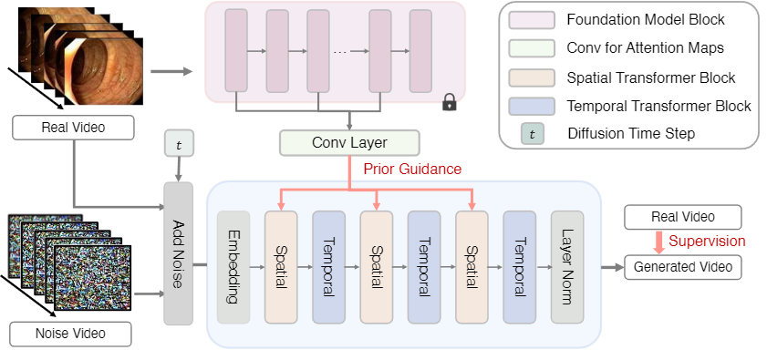
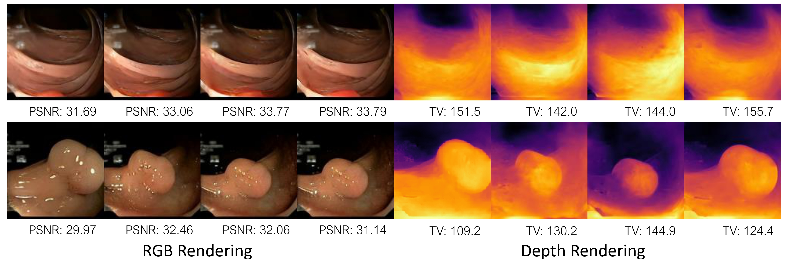

# *Endora*: Video Generation Models as Endoscopy Simulators 

<p align="center">
  
</p>


### [Project Page](TBD) | [ArXiv Paper](TBD)


[Chenxin Li](https://xggnet.github.io/)<sup>1*</sup> [Hengyu Liu]()<sup>1*</sup> [Yifan Liu](https://yifliu3.github.io/)<sup>1*</sup> [Brandon Y. Feng](https://brandonyfeng.github.io/)<sup>2</sup> [Wuyang Li](https://wymancv.github.io/wuyang.github.io/)<sup>1</sup> [Xinyu Liu](https://xinyuliu-jeffrey.github.io/)<sup>1</sup> [Zhen Chen](https://franciszchen.github.io/)<sup>3</sup> [Jing Shao](https://amandajshao.github.io/)<sup>4</sup> [Yixuan Yuan](https://www.ee.cuhk.edu.hk/en-gb/people/academic-staff/professors/prof-yixuan-yuan)<sup>1✉</sup>
<!-- 
[Yifan Liu](https://yifliu3.github.io/)<sup>1*</sup>, [Chenxin Li](https://xggnet.github.io/)<sup>1*</sup>,
[Chen Yang](https://scholar.google.com/citations?user=C6fAQeIAAAAJ&hl)<sup>2</sup>, [Yixuan Yuan](https://www.ee.cuhk.edu.hk/en-gb/people/academic-staff/professors/prof-yixuan-yuan)<sup>1✉</sup> -->

<sup>1</sup>CUHK EE &emsp; <sup>2</sup>MIT CSAIL &emsp; <sup>3</sup>CAS CAIR &emsp; <sup>4</sup>Shanghai AI Lab &emsp;

<sup>\*</sup> Equal Contributions. <sup>✉</sup> Corresponding Author. 

-------------------------------------------


## 💡Key Features
- A high-fidelity **medical video generation** framework, tested on endoscopy scenes, laying the groundwork for further advancements in the field.
- The first public **benchmark for endoscopy video generation**, featuring a comprehensive collection of clinical videos and adapting existing general-purpose generative video models for this purpose.
- A novel technique to infuse generative models with **features distilled from a 2D visual foundation model**, ensuring consistency and quality across different scales.
- **Versatile ability through successful applications** in video-based disease diagnosis and 3D surgical scene reconstruction, highlighting its potential for downstream medical tasks

## 🛠Setup

```bash
git clone https://github.com/XGGNet/Endora.git
cd Endora
conda create -n Endora python=3.10
conda activate Endora

pip install torch==2.1.2 torchvision==0.16.2 torchaudio==2.1.2 --index-url https://download.pytorch.org/whl/cu118

pip install -r requirements.txt
```

**Tips A**: We test the framework using pytorch=2.1.2, and the CUDA compile version=11.8. Other versions should be also fine but not totally ensured.

**Tips B**: GPU with 24GB (or more) is recommended for video sampling by <i>Endora</i> inference, and 48GB (or more) for <i>Endora</i> training. 

## 📚Data Preparation
**Colonoscopic**:  The dataset provided by [paper](https://ieeexplore.ieee.org/abstract/document/7442848) can be found [here](http://www.depeca.uah.es/colonoscopy_dataset/). You can directly use the [processed video data](https://mycuhk-my.sharepoint.com/:u:/g/personal/1155167044_link_cuhk_edu_hk/ES_hCHb2XWFJgsK4hrKUnNUBx3fl6QI3yyk9ImP4AkkRVw?e=LC4DU5) by *[Endo-FM](https://github.com/openmedlab/Endo-FM)* without further data processing.
<!-- The dataset provided in [Colonoscopic](https://arxiv.org/abs/2206.15255) is used. You can download and process the dataset from their website (https://github.com/med-air/EndoNeRF). We use the two accessible clips including 'pulling_soft_tissues' and 'cutting_tissues_twice'. -->

**Kvasir-Capsule**:  The dataset provided by [paper](https://www.nature.com/articles/s41597-021-00920-z) can be found [here](https://datasets.simula.no/kvasir-capsule/). You can directly use the [processed video data](https://mycuhk-my.sharepoint.com/:u:/g/personal/1155167044_link_cuhk_edu_hk/EQhyk3_yz5pAtdpKVFU93S0BfPfTNpblPFXTHaW-BIjV-Q?e=9duP5z) by *[Endo-FM](https://github.com/openmedlab/Endo-FM)* without further data processing.
<!-- The dataset provided in [Kvasir-Capsule](https://arxiv.org/abs/2206.15255) is used. You can download and process the dataset from their website (https://github.com/med-air/EndoNeRF). We use the two accessible clips including 'pulling_soft_tissues' and 'cutting_tissues_twice'. -->


**CholecTriplet**:  The dataset provided by [paper](https://www.sciencedirect.com/science/article/pii/S1361841522000846) can be found [here](https://cholectriplet2021.grand-challenge.org/). You can directly use the [processed video data](https://mycuhk-my.sharepoint.com/:u:/g/personal/1155167044_link_cuhk_edu_hk/EQhyk3_yz5pAtdpKVFU93S0BfPfTNpblPFXTHaW-BIjV-Q?e=9duP5z) by *[Endo-FM](https://github.com/openmedlab/Endo-FM)* without further data processing.
<!-- The dataset provided in [CholecTriplet](https://endovissub2019-scared.grand-challenge.org/) is used. To obtain a link to the data and code release, sign the challenge rules and email them to max.allan@intusurg.com. You will receive a temporary link to download the data and code. -->
<!-- Follow [MICCAI_challenge_preprocess](https://github.com/EikoLoki/MICCAI_challenge_preprocess) to extract data.  -->

Please run [`process_data.py`](process_data.py) and [`process_list.py`](process_list.py) to get the split frames and the corresponding list at first.
```bash
CUDA_VISIBLE_DEVICES=gpu_id python process_data.py -s /path/to/datasets -t /path/to/save/video/frames

CUDA_VISIBLE_DEVICES=gpu_id python process_list.py -f /path/to/video/frames -t /path/to/save/text
```

The resulted file structure is as follows.
```
├── data
│   ├── CholecT45
│     ├── 00001.mp4
|     ├──  ...
│   ├── Colonoscopic
│     ├── 00001.mp4
|     ├──  ...
│   ├── Kvasir-Capsule
│     ├── 00001.mp4
|     ├──  ...
│   ├── CholecT45_frames
│     ├── train_128_list.txt
│     ├── 00001 
│           ├── 00000.jpg
|           ├── ...
|     ├──  ...
│   ├── Colonoscopic_frames
│     ├── train_128_list.txt
│     ├── 00001
│           ├── 00000.jpg
|           ├── ...
|     ├──  ...
│   ├── Kvasir-Capsule_frames
│     ├── train_128_list.txt
│     ├── 00001
│           ├── 00000.jpg
|           ├── ...
|     ├──  ...
```


## 🎇Sampling Endoscopy Videos

You can directly sample the endoscopy videos from the checkpoint model. Here is an example for quick usage for using our **pre-trained models**:
1. Download the pre-trained weights from [here](https://stuxmueducn-my.sharepoint.com/:f:/g/personal/chenxinli_stu_xmu_edu_cn/EnlDBG3dzwlPnSjqYdpp4l8BfettnJoeX1XVSX_BIVNyHQ?e=W6kXM9) and put them to specific path defined in the configs.
2. Run [`sample.py`](sample/sample.py) by the following scripts to customize the various arguments like adjusting sampling steps. 
<!-- with [`sample.py`](sample/sample.py). Weights for our pre-trained Latte model can be found [here](https://huggingface.co/maxin-cn/Latte).  
The script has various arguments to adjust sampling steps. -->
 <!-- change the classifier-free guidance scale, etc. For example, to sample from our model on FaceForensics, you can use: -->
Simple Sample to generate a video
```bash
bash sample/col.sh
bash sample/kva.sh
bash sample/cho.sh
```
DDP sample
```bash
bash sample/col_ddp.sh
bash sample/kva_ddp.sh
bash sample/cho_ddp.sh
```

<!-- or if you want to sample hundreds of videos, you can use the following script with Pytorch DDP:

```bash
bash sample/ffs_ddp.sh
``` -->

<!-- If you want to try generating videos from text, please download [`t2v_required_models`](https://huggingface.co/maxin-cn/Latte/tree/main/t2v_required_models) and run `bash sample/t2v.sh`. -->


## ⏳Training Endora
The weight of pretrained DINO can be found [here](https://github.com/facebookresearch/dino), and in our implementation we use ViT-B/8 during training Endora. And the saved path need to be edited in [`./configs`](./configs/)

Train Endora with the resolution of 128x128 with `N` GPUs on the Colonoscopic dataset
```bash
torchrun --nnodes=1 --nproc_per_node=N train.py \
  --config ./configs/col/col_train.yaml \
  --port PORT \
  --mode type_cnn \
  --prr_weight 0.5 \
  --pretrained_weights /path/to/pretrained/DINO
```
Run training Endora with scripts in [`./train_scripts`](./train_scripts/)
```bash
bash train_scripts/col/train_col.sh
bash train_scripts/kva/train_kva.sh
bash train_scripts/cho/train_cho.sh
```
<!-- We provide the scripts [`train_endora.py`](train_with_img.py).  -->
<!-- Similar to [`train.py`](train.py) scripts, this scripts can be also used to train class-conditional and unconditional
Latte models. For example, if you wan to train Latte model on the FaceForensics dataset, you can use -->
<!-- We provide a training script for Latte in [`train.py`](train.py). This script can be used to train class-conditional and unconditional
Latte models. To launch Latte (256x256) training with `N` GPUs on the FaceForensics dataset: -->
<!-- 
```bash
torchrun --nnodes=1 --nproc_per_node=N train.py --config ./configs/ffs/ffs_train.yaml
``` -->
<!-- or If you have a cluster that uses slurm, you can also train Latte's model using the following scripts:

 ```bash
sbatch slurm_scripts/ffs.slurm
``` -->

<!-- We also provide the video-image joint training scripts [`train_with_img.py`](train_with_img.py). Similar to [`train.py`](train.py) scripts, this scripts can be also used to train class-conditional and unconditional
Latte models. For example, if you wan to train Latte model on the FaceForensics dataset, you can use:

```bash
torchrun --nnodes=1 --nproc_per_node=N train_with_img.py --config ./configs/ffs/ffs_img_train.yaml
``` -->
<!-- 
For training video generation on, run 
``` 
python train.py -s data/endonerf/pulling --port 6017 --expname endonerf/pulling --configs arguments/endonerf/pulling.py 
``` 
You can customize your training config through the config files.
 -->

## 📏Metric Evaluation
We first split the generated videos to frames and use the code from [StyleGAN](https://github.com/universome/stylegan-v) to evaluate the model in terms of FVD, FID and IS.  

Test with [`process_data.py`](./process_data.py) and code in [stylegan-v](https://github.com/universome/stylegan-v)
```bash
CUDA_VISIBLE_DEVICES=gpu_id python process_data.py -s /path/to/generated/video -t /path/to/video/frames
cd /path/to/stylegan-v
CUDA_VISIBLE_DEVICES=gpu_id python ./src/scripts/calc_metrics_for_dataset.py \
  --fake_data_path /path/to/video/frames \
  --real_data_path /path/to/dataset/frames 
```
Test with scipt [`test.sh`](./test.sh)
```bash
bash test.sh
```
## ⏳Running Compared Methods Re-implemented on Endoscopy
We provide the code of training and testing scripts of compared methods on endoscopy video generation (as shown in Table 1. Quantitative Comparison in paper).
Please enter [Other-Methods/](https://github.com/XGGNet/Endora/tree/main/Other-Methods) for more details. We will keep cleaning up the code.

<!-- 
```bash
torchrun --nnodes=1 --nproc_per_node=N train.py --config ./configs/ffs/ffs_train.yaml %StyleGAN-V
torchrun --nnodes=1 --nproc_per_node=N train.py --config ./configs/ffs/ffs_train.yaml %LVDM
torchrun --nnodes=1 --nproc_per_node=N train.py --config ./configs/ffs/ffs_train.yaml %MoStGAN-V
```

The testing scripts:
```bash
torchrun --nnodes=1 --nproc_per_node=N train.py --config ./configs/ffs/ffs_train.yaml %StyleGAN-V
torchrun --nnodes=1 --nproc_per_node=N train.py --config ./configs/ffs/ffs_train.yaml %LVDM
torchrun --nnodes=1 --nproc_per_node=N train.py --config ./configs/ffs/ffs_train.yaml %MoStGAN-V
``` -->

The pre-trained weights for all the comparison methods are available [here](https://stuxmueducn-my.sharepoint.com/:f:/g/personal/chenxinli_stu_xmu_edu_cn/EhoRsCt9tetAso44IFivC-EBcmt1UR_Zz0zmmwzI09tB9w?e=5QAuo6).

Here is an overview of performance&checkpoints on Colonoscopic Dataset.
|Method| FVD↓ | FID↓ | IS↑ | Checkpoints |
|-----|------|-----|-----|-----|
|StyleGAN-V| 2110.7 | 226.14 | 2.12| [Link](https://stuxmueducn-my.sharepoint.com/:f:/g/personal/chenxinli_stu_xmu_edu_cn/Enw7y_TPHZNEt4UvRGStL3cBhXwe2Xo190XXDBDil5ZHkw?e=LZk0rV)|
|LVDM| 1036.7 | 96.85 | 1.93| [Link](https://stuxmueducn-my.sharepoint.com/:f:/g/personal/chenxinli_stu_xmu_edu_cn/EmfK-GdAzkhBoDLG_g1QhxABYr_7g31w0lEQB64xAfO15A?e=nnAEnL)|
|MoStGAN-V| 468.5 | 53.17 | 3.37| [Link](https://stuxmueducn-my.sharepoint.com/:f:/g/personal/chenxinli_stu_xmu_edu_cn/EiMG8BetkKZNnJWKooCPj24BhZ8O-bG9Whrxb1MTtJDheQ?e=ciMagR)|
|Endora (Ours)| 460.7 | 13.41 | 3.90| [Link](https://stuxmueducn-my.sharepoint.com/:u:/g/personal/chenxinli_stu_xmu_edu_cn/EWWmifN-qwVFsN8TBp0ePQ4BnOGIdRpdFItvlnlKWxQ0qg?e=vYzURY)|

<!-- - What are contained in the checkpoints:

```
**.pth
├── model: state dictionaries of the model
├── flop: a list containing the GFLOPs corresponding to exiting at each stage
├── anytime_classification: Top-1 accuracy of each stage
├── budgeted_batch_classification: results of budgeted batch classification (a two-item list, [0] and [1] correspond to the two coordinates of a curve)

``` -->


## ⏳Ablation on Endora's Variants
We also provide the training of other variants of Endora (as shown in Table 3. Ablation Studies in paper). Training and Sampling Scripts are in [`train_scripts/ablation`](./train_scripts/ablation) and [`sample/ablation`](./sample/ablation) respectively.
```bash
bash /train_scripts/ablation/train_col_ablation{i}.sh  % e.g., i=1 to run the 1st-row ablation experiments. 
bash /sample/ablation/col_ddp_ablation{i}.sh  % e.g., i=1 to run the 1st-row ablation experiments. 
```
|Modified Diffusion| Spatiotemporal Encoding | Prior Guidance | FVD↓ | FID↓ | IS↑ | Checkpoints 
|-----|------|-----|-----|-----|-----|------|
|<span style="color: red;">&#10060;</span>| <span style="color: red;">&#10060;</span> | <span style="color: red;">&#10060;</span> | 2110.7 | 226.14 | 2.12| [Link](https://stuxmueducn-my.sharepoint.com/:u:/g/personal/chenxinli_stu_xmu_edu_cn/EdVg_dgCizxNuQQ0ABzy1HgBU91vT-oJjtwuDBaAMv5XgQ?e=LSuZiy)|
 |&#x2705;|<span style="color: red;">&#10060;</span> | <span style="color: red;">&#10060;</span>|1036.7 | 96.85 | 1.93| [Link](https://stuxmueducn-my.sharepoint.com/:u:/g/personal/chenxinli_stu_xmu_edu_cn/ESZvweBhKvRNnn0Ci8d331YB7BDJ4fHQSIFW7WDYial-tw?e=Rh0LlF)|
|&#x2705;|&#x2705;| <span style="color: red;">&#10060;</span> | 468.5 | 53.17 | 3.37| [Link](https://stuxmueducn-my.sharepoint.com/:u:/g/personal/chenxinli_stu_xmu_edu_cn/ET6q0C6b1PxFmINnqWmZFk0BVjGxb5oHHitC2lGOeokO5g?e=jE5rw8)|
|&#x2705;|&#x2705;| &#x2705;| 468.5 | 53.17 | 3.37| [Link](https://stuxmueducn-my.sharepoint.com/:u:/g/personal/chenxinli_stu_xmu_edu_cn/EfXBvHIfM6JOh3jPTI63orgBQeEoHH8-wJG1HTy0YgqQ-g?e=c5N6qa)|


## ⏳Downstream Application
We provide the reproduction steps for reproducing the results of extending Endora to downstream applications (as shown in Section 3.3 in paper).
### Case I. Temporal-consistent Data Augmentation
Please follow the steps:
1. Enter the path "Downstream-Semi/"
1. Download **PolypDiag** dataset provided by [paper](https://link.springer.com/chapter/10.1007/978-3-031-16437-8_9) from [here](https://github.com/tianyu0207/weakly-polyp). You can directly use the [processed video data](https://mycuhk-my.sharepoint.com/personal/1155167044_link_cuhk_edu_hk/_layouts/15/onedrive.aspx?id=%2Fpersonal%2F1155167044%5Flink%5Fcuhk%5Fedu%5Fhk%2FDocuments%2FEndo%2DFM%2Fdata%2Fdownstream%2FPolypDiag%2Etar&parent=%2Fpersonal%2F1155167044%5Flink%5Fcuhk%5Fedu%5Fhk%2FDocuments%2FEndo%2DFM%2Fdata%2Fdownstream&ga=1) by [Endo-FM](https://github.com/med-air/Endo-FM) without further data processing.
2. Run the script ```bash semi_baseline.sh``` to obtain the Supervised-only lowerbound of semi-supervised disease diagnosis.
3. Sample the endoscopy videos on **Colonoscopic** and **CholecTriplet** as augmented data. We also provide the sampled videos [here](https://stuxmueducn-my.sharepoint.com/:f:/g/personal/chenxinli_stu_xmu_edu_cn/EldIvXX8XolMiNIA3aILL4EB60tPreDrAW-SrcnuespmFg?e=loZIln) for direct usage.
4. Run the script ```bash semi_gen.sh``` for semi-supervised disease diagnosis using the augmented unlabeled data.
   

|Method|Colonoscopic |CholeTriplet |
|-----|------|-----|
|Supervised-only | 74.5  | 74.5 |
|LVDM | 76.2  | 78.0 
|Endora (Ours)| 87.0 | 82.0 |


### Case II. View-consistent Scene Simulator
Please follow the steps:
1. Run [COLMAP](https://github.com/colmap/colmap) on the generated videos as the point initialization.
2. Use [EndoGaussian](https://github.com/yifliu3/EndoGaussian) to train 3D representation of Gaussian Splatting.

Videos of Rendered RGB & Rendered Depth
<p align="center">
  
</p>

<!-- ## Rendering & Reconstruction(optional)
Run the following script to render the images.  

```
python render.py --model_path output/endonerf/pulling  --skip_train --skip_video --configs arguments/endonerf/pulling.py
```
You can use `--skip_train`, `--skip_test`, and `--skip_video` to skip rendering images of training, testing, and video set. By default, all three sets are rendered.

Besides, we also provide point cloud reconstruction function, you can add extra arguments `--reconstruct` to activate it. -->

<!-- ## Evaluation
You can just run the following script to evaluate the model.  

```
python metrics.py --model_path output/endonerf/pulling
``` -->

## 🛒TODO List
- [X] Upload the ckpt for compared methods.
- [ ] Clean up the codes for training compared methods.


## 🎈Acknowledgements
Greatly appreciate the tremendous effort for the following projects!
- [Endo-FM](https://github.com/openmedlab/Endo-FM)
- [Latte](https://github.com/Vchitect/Latte)
- [EndoGaussian](https://github.com/yifliu3/EndoGaussian)
- [CoMatch](https://github.com/salesforce/CoMatch)
- [Stylegan-v](https://github.com/universome/stylegan-v)

<!-- Some source code of ours is borrowed from [3DGS](https://github.com/graphdeco-inria/gaussian-splatting), [4DGS](https://github.com/hustvl/4DGaussians), and [EndoNeRF](https://github.com/med-air/EndoNeRF). Thanks for their contributions.  -->

## 📜Citation
If you find this work helpful for your project,please consider citing the following paper:
```
@misc{
      TBD
}
```
